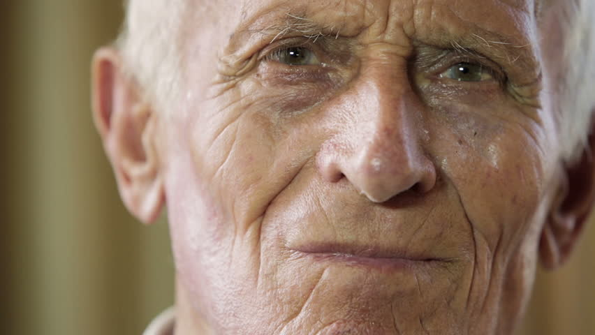

# wrinkles-detection

          

##                               I .    D   .     L        PROJECT

# Our aim of this project is to basically help the health care to detect wrinkles of old people with the help of computer vision.

# we are currently researching the ways to use basic image processing deep learning method or tensorflow api to help in detecting wrinkles.

## There are 3 ways we will compare then after we finish the best one will be used for the detection in the health care

### 1. haarcascade

### 2. cnn with detection box and image tensor and labelling tools
#### a. classification part without detection boxes:

### 3.tensorflow object detection api without using transfer learning

# Done by:

## Navin:

## Winner:

## Jiadong:

## Rohit

# For  the classificiation coding refer to my another repository  <h ref = "https://github.com/navin20/Image-Classification-Using-Keras"
# for the code and just modify it according to the folder

